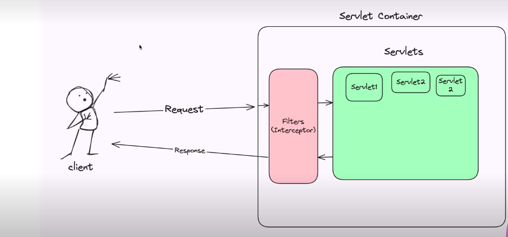
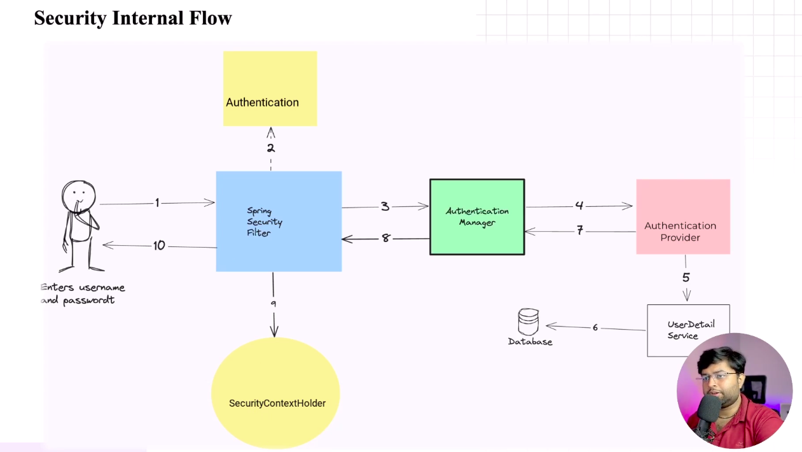
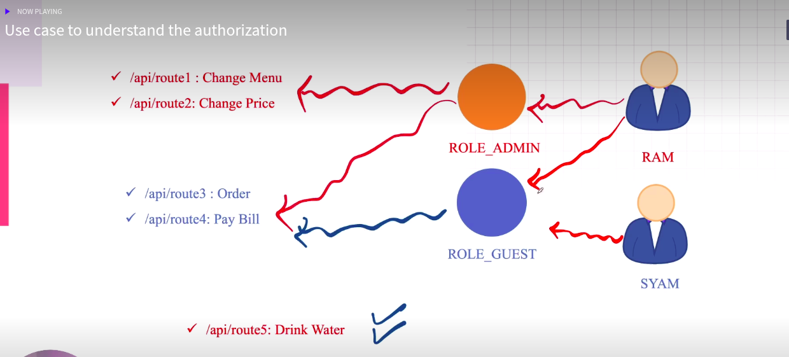
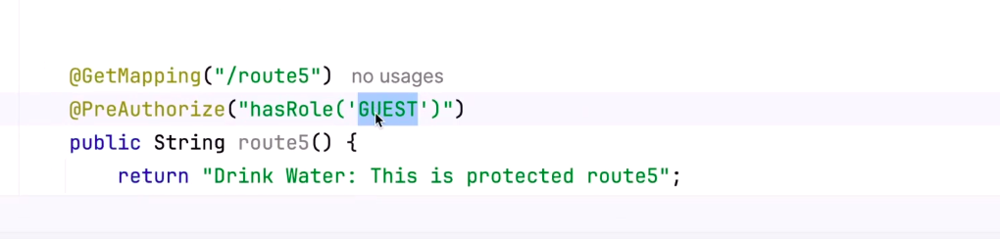

# Spring Security

# Spring Security configuration

1. To enable spring security in project we have to add dependency into the project.
2. Name of the dependency is **Spring Boot Starter Security**
3. To add dependency we have to add below dependency into our pom.xml file.

```
<dependency>
    <groupId>org.springframework.boot</groupId>
    <artifactId>spring-boot-starter-security</artifactId>
</dependency>
```

4. whenever we add **Spring boot starter security** dependency into the project by **default it secure all the API
   endpoints**.

5. when we try to access any api after adding spring boot starter security, it will ask you to userName and password.So,
   default userName is **user** and password is generated during running time which is console in output with a key as *
   *Using generated security password**

# To change the default username and password generation

1. To **change** the default **username** and **password** generation, we need to add Spring Security configuration to
   the **application.properties** file.

```
spring.security.username=rashi
spring.security.password=rashi
```

2. Now, after adding this into configuration file you will notice that default password is not generated into the
   console.

# Another way to configure username and password

1. create one configuration class and annotate that class with **@Configuration**
2. create one bean of **UserDetailsService** class inside this class

```
@Configuration
public class SecurityConfig {
    @Bean
    public UserDetailsService userDetailsService() {
        //database nhi user karenge
        //creating users
        UserDetails user1 = User.withDefaultPasswordEncoder()
                .username("durgesh")
                .password("durgesh")
                .roles("ADMIN", "GUEST")
                .build();

        UserDetails user2 = User.withDefaultPasswordEncoder()
                .username("ankit")
                .password("ankit123")
                .roles("ADMIN")
                .build();
        //creating in memory userDetailManager: that is user detail service implementation
        //providing user1 and user2 to userDetailService

        InMemoryUserDetailsManager inMemoryUserDetailsManager = new InMemoryUserDetailsManager(user1, user2);

        return inMemoryUserDetailsManager;
    }
}
```

# Implement Customs Authentication

# UserDetailsService Interface

1. It's an **interface** in spring security.
2. Main purpose: To **load user-specific** data during authentication
3. We can implement this when we want to authenticate users from our own Database(not in-memory users).

```
public interface UserDetailsService {
    UserDetails loadUserByUsername(String username) throws UsernameNotFoundException;
}
```

# Role of Servlet and Filter



# Security Internal Flow



**Note** To enable web security debug mode we have to add ***@EnableWebSecurity(debug=true)***

# Spring BootWebSecurity Configuration

## SpringBootWebSecurityConfiguration

1. SpringBootWebSecurityConfiguration provides the default setup only when a custom one is not provided.
2. This configuration is only applied if you don’t provide your own security configuration.
3. By default every end points is protected due to this configuration.
4. ## ```Default Behavior of SpringBootWebSecurityConfiguration```
    1. All endpoints are secured
    2. A default login form is provided
    3. A Default user is created with a random password(shown in the console)
    4. Basic HTTP authentication is enabled.

# How to create custom spring boot Web Security configuration

1. By default, Spring Boot uses SpringBootWebSecurityConfiguration to auto-configure basic security settings when no
   custom SecurityFilterChain bean is defined.
2. ```To create a **custom security configuration**, we must define a **SecurityFilterChain** bean```. When this bean is
   present
   in
   the application context, Spring Boot will skip its default configuration provided by
   SpringBootWebSecurityConfiguration

```
 @Bean
    public SecurityFilterChain securityFilterChain(HttpSecurity httpSecurity) throws Exception {
        //configurations
        httpSecurity.authorizeHttpRequests(request -> {
//            request.anyRequest().permitAll();
            request.requestMatchers("/api/route2").permitAll();
            request.anyRequest().authenticated();
//            request.requestMatchers(HttpMethod.GET,"/products").permitAll();
        });
        httpSecurity.formLogin(Customizer.withDefaults());
        return httpSecurity.build();
    }
```

# Authentication

Authentication is the **process of verifying the identity** of a user.

1. You enter your username and password to login into a website.
2. The system checks if your credentials are valid.
3. If valid → you're authenticated.

   ## **In Spring Security**:
    1. Authentication happens when you submit the login form.
    2. Spring Security calls **UserDetailsService.loadUserByUsername()** to fetch user info.
    3. Then it compares the entered password with the one stored in the database (using password encoder).

# Authorization

Authorization is the process of checking what actions a user is allowed to perform after they are authenticated.

1. After logging in, can you access the admin page?
2. Can you edit another user's profile?
3. These are authorization decisions.
   ## **In Spring Security:**
    1. You define which roles can access which URLs.
   ```
   http
   .authorizeHttpRequests()
   .requestMatchers("/admin/**").hasRole("ADMIN")
   .anyRequest().authenticated();

   ```

# Authority

1. It represents a single permission or privilege a user has within the application.
2. Spring Security uses **GrantedAuthority** objects to determine if a users can perform a specific action.

# Role

1. **GrantedAuthority** that groups related permissions together.
2. It represents a broader user designation like "ADMIN","EDITOR","USER"
3. By default, role in Spring Security have a "ROLE_" prefix attached (eg:-"ROLE_ADMIN")

# Assignment

# Method Level Security

To enable method level security we have to add ```@EnableMethodSecurity(prePostEnabled=true)``` annotation in our
securityConfiguration class.

we can use different method to the method level annotation.


# References

1. https://docs.spring.io/spring-boot/appendix/application-properties/index.html (common spring security properties)
2. https://www.baeldung.com/spring-security-enable-logging (enable spring security logs)
3. https://medium.com/@tanmaysaxena2904/spring-security-the-security-filter-chain-e09e1f53b73d (Security Internal Flow)
4. https://wankhedeshubham.medium.com/spring-boot-security-flow-dbc3d51b0f2 (Security Internal Flow)
5. https://medium.com/@punnapavankumar9/securing-spring-applications-with-method-level-security-5fb70811179e (Method
   level security)
6. https://www.youtube.com/watch?v=h-9vhFeM3MY&t=105s (Internal working of Spring Security)

# Classes To Explore

1. UserDetails
2. UserDetailsService
3. InMemoryUserDetailsManager
4. SpringBootWebSecurityConfiguration (need to read)
5. GrantedAuthority

# Methods To Explore

1. loadUserByUserName
