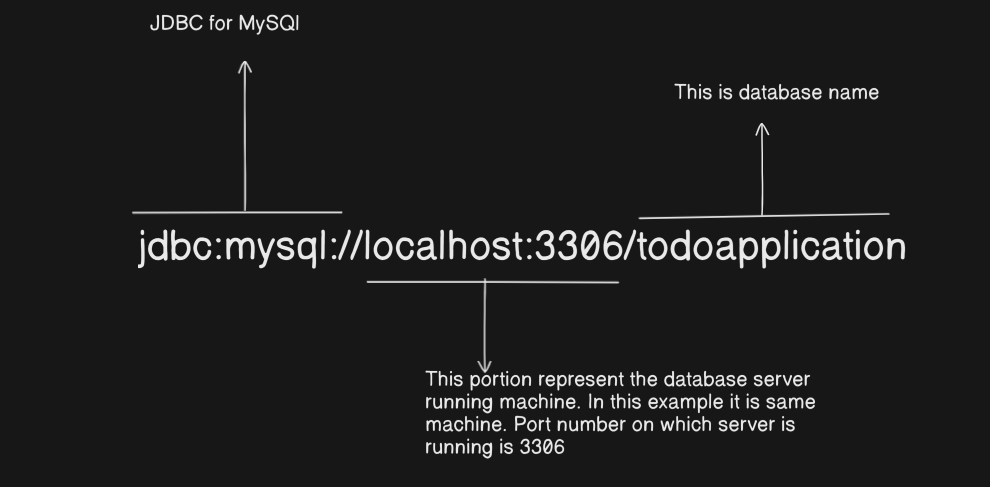

# How to configure Database with project.

1. To confiure database with project we have to add these code into our configuration file ie application.properties

```
spring.datasource.url=jdbc:mysql://localhost:3306/orm
spring.datasource.username=root
spring.datasource.password=root
spring.datasource.driver-class-name=com.mysql.cj.jdbc.Driver
```

- `spring.datasource.url=jdbc:mysql://localhost:3306/orm`
  
- `spring.datasource.username=root`
    - This is username for connecting to the database server


- `spring.datasource.password=root`
    - This password for connecting to database server


- `spring.datasource.driver-class-name=com.mysql.cj.jdbc.Driver`
    - Specifies the `JDBC driver class` for MySQl
    - It required because java does not natively support database communication. it relies on database-specific drivers
      to interact with different databases like MySQL, PostgreSQL, Oracle etc
    - Required only in `older versions` of spring boot(Spring Boot 2+ usually detects it automatically)
    - It tells spring Boot which database driver to use when connecting to MySQL.

```
spring.jpa.hibernate.ddl-auto=update
spring.jpa.show-sql=true
spring.jpa.properties.hibernate.dialect=org.hibernate.dialect.MySQL8Dialect
```

- `spring.jpa.hibernate.ddl-auto=update`
    - This property `controls how Hibernate updates the database schema`(`tables, columns, constraints`) when your
      spring boot application starts.
    - ddl-auto stands for `Data Definition Language (DDL) Auto`
    - default value is **none**</span>
    - **Possible values**:-
        - none - **No changes** to the database schema.
        - update - **Updates the schema** without dropping existing tables.
        - create - **Creates the schema** every time the app starts (deletes old data).
        - create-drop - Creates the schema **on startup**, then **drops it** on shutdown.
        - validate - **Only validates** the schema (does not modify it).


- `spring.jpa.show-sql=true`
    - Enables SQL query logging in the console
    - when set to true, spring boot logs all SQL queries executed by JPA


- `spring.jpa.properties.hibernate.dialect=org.hibernate.dialect.MySQL8Dialect`
    - This property **tells Hibernate how to generate SQL queries** for your database.
    - Different database (`MySQL, PostgreSQL, Oracle` etc) have different SQL syntax.
    - Hibernate `needs to know which database you are using` so, it can generate the correct SQL queries.
    - ```aiignore
    1. MySQL uses LIMIT for pagination.
    2. Oracle uses ROWNUM instead.
    3. PostgreSQL uses OFFSET and LIMIT.
    ```

**Note**:-If Hibernate doesn't know the database type, it might generate incorrect SQL queries.

# References

1. https://medium.com/@yadavsunil9699/a-comprehensive-guide-to-annotations-in-spring-boot-jpa-950a05b5eb1b (All
   annotations used in spring JPA)
2. https://medium.com/@himani.prasad016/validations-in-spring-boot-e9948aa6286b (All annotations used for validation)
3. https://www.geeksforgeeks.org/spring-boot-validation-using-hibernate-validator/ (All annotations used for validation)
4. https://medium.com/@AlexanderObregon/understanding-springs-jsonbackreference-and-jsonmanagedreference-annotations-783090468572 (avoid infinite recursion loop)


