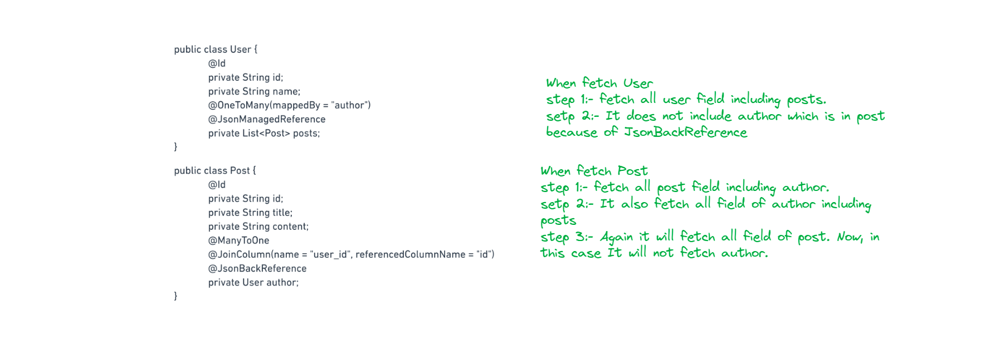

## Jackson Annotation and It's Explanation

Jackson is a Java library used to **`convert Java Objects into JSON`** and **`JSON into Java objects`** (also called **`serialization`** & **`deserialization`**). It is widely used in Spring boot applications for handling JSON data.

## Key Features of Jackson

1. **Serialization** → Converts Java objects → JSON
2. **Deserialization** → Converts JSON → Java objects
3. **Annotations** → Customize JSON output
4. **Streaming API** → Read/Write large JSON data efficiently

## Jackson Annotation

1. **`@JsonIgnore`** - Excluding Fields

   1. This annotation is used to **exclude a specific field** from JSON serialization (converting Java object to JSON) and deserialization (converting JSON to Java object).

   2. It is a **field level** annotation

   3. Ignored in Serialization: The field will not be included in the JSON output.

   4. Ignored in Deserialization: The field will not be set even if it exists in the input JSON.

## Example

```
public class User {
 private String id;
 private String name;

 @JsonIgnore  // Ignores this field in JSON
 private String password;

 public User(String id, String name, String password) {
     this.id = id;
     this.name = name;
     this.password = password;
     }
 }
```

## output

```
{
 "id": "1",
 "name": "John Doe"
}

```

2.  **`@JsonIgnoreProperties`** - Excluding multiple fields

    1. Ignore multiple fields at once or unknown fields
    2. Class and Field level annotation

       ## Example 1

       ```
       @JsonIgnoreProperties({"password", "phoneNumber"})
       public class User {
           private String id;
           private String name;
           private String password;
           private String phoneNumber;
           }
       ```

    3. In this example password and phoneNumber is ignore when serialize and deserialize.

       ## Example 2

       ```
       public class UserDto {
       private String id;

       private String name;

       private String address;

       private String phoneNumber;
       @JsonIgnoreProperties({"user"})
       private List<NoteDto> noteList;
       }

       public class PostDto {
        private String id;
        private String title;
        private String content;
        private User author;
       }
       ```

       ## Output

       ```
       {
        "id": "123",
        "name": "John Doe",
        "address": "New York",
        "phoneNumber": "9876543210",
        "noteList": [
            {
                "id": "n1",
                "message": "Complete the project",
                "createdAt": "2025-03-02T03:48:11.141+00:00",
                "completedAt": "2025-03-05T03:48:11.141+00:00"
             },
            {
                "id": "n2",
                "message": "Prepare for the meeting",
                "createdAt": "2025-03-03T04:15:46.982+00:00",
                "completedAt": "2025-03-06T04:15:46.982+00:00"
            }
        ]
       }

       ```

    4. In this example noteList is annotated with **@JsonIgnoreProperties**. It specify that ignore the user field of NoteDto.

    5. When ever UserDto is called then it can serialize all the fields inside it like id,name,address and noteList but it can ignore the user field of NoteDto

3.  **`Jackson’s Solution: @JsonManagedReference and @JsonBackReference`**

    1. This prevents `infinite recursion` during JSON serialization
    2. `@JsonManagedReference` is used on parent side.

       - This is the "forward" part of the relationship. It tells Jackson to handle the serialization of the associated property. The resulting JSON will include the details of this property.

    3. `@JsonBackReference` is used on child side.
       - This denotes the “backward” or reverse side of the relationship. Jackson will recognize this and avoid serializing the property, preventing the infinite recursion that we discussed in the previous section.

    ```
    public class User {
        private Long id;
        private String name;
        @JsonManagedReference
        private List<Post> posts;
        }

    public class Post {
        private Long id;
        private String title;
        private String content;

        @JsonBackReference
        private User author;
        }
    ```

    4. When a User object is serialized, Jackson will include the list of Post objects associated with that user in the resulting JSON.

    5. However, while processing each Post object, Jackson sees the @JsonBackReference annotation on the author property and avoids serializing it. This means the Post won't contain the full details of the User again, effectively breaking the infinite serialization loop.

    

4.  **`@JsonFormat`**

    1. The @JsonFormat annotation in Jackson is used to control how dates, times, and other values are formatted during serialization (Java → JSON) and deserialization (JSON → Java).
    2. By default, Jackson may not format dates/times properly, leading to issues when sending or receiving JSON data. @JsonFormat helps to:
    3. Specify the date format (e.g., dd-MM-yyyy instead of the default timestamp).
    4. Define timezone adjustments to avoid time mismatches.
    5. Format enums as Strings instead of default numbers.

    ## Example

    ```
    public class User {
        private String name;
        @JsonFormat(shape = JsonFormat.Shape.STRING, pattern = "dd-MM-yyyy", timezone = "UTC")
        private Date birthDate;
        }
    ```

    ## output

    ```
    {
    "name": "John Doe",
    "birthDate": "15-02-1995"
    }

    ```
